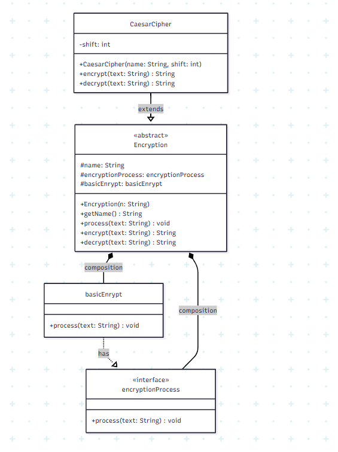

# Strukdat-OOP-Class-Diagram-2026

---

# Identitas Mahasiswa

Nama :  Bambang Nasarillah Kurniawan

NRP : 5027251110

Kelas :  A

---

# Study Case
## SECRET DIARY
Dalam kehidupan sehari hari di masa sekarang, banyak orang menggunakan diary digital untuk menuliskan pengalaman, perasaan atau hal hal pribadi , isi diary bersifat sangat sensitif sehingga tidak semua orang boleh membacanya. Masalahnya muncul ketika diary tersebut dibuka atau dibaca oleh orang lain tanpa izin, sehingga privasi penulis tersebut terganggu😒, rahasianya bisa terbongkar,😥 aibnya bisa tersebar😞 bahkan bisa menyebapkan masalah yang lebih besar😖.

Untuk mengatasi hal tersebut saya membuat aplikasi sederhana yang dapat mengacak isi tulisan diary menggunakan metode enkripsi. Dengan cara ini, text yang ditulis akan berubah menjadi bentuk yang sulit dipahami orang lain. Selain itu program ini juga menyediakan fitur untuk mengembalikan teks ke bentuk semula, sehingga user tetap bisa membaca kembali isi diarinya dengan mudah

---

# Diagram Class

Berikut adalah gambar dari diagram yang saya render dari mermaid.ai



dengan code class diagram seperti ini:

```bash
classDiagram
    class encryptionProcess {
        <<interface>>
        +process(text: String) void
    }

    class Encryption {
        <<abstract>>
        #name: String
        #encryptionProcess: encryptionProcess
        #basicEnrypt: basicEnrypt
        +Encryption(n: String)
        +getName() String
        +process(text: String) void
        +encrypt(text: String) String
        +decrypt(text: String) String
    }

    class basicEnrypt {
        +process(text: String) void
    }

    class CaesarCipher {
        -shift: int
        +CaesarCipher(name: String, shift: int)
        +encrypt(text: String) String
        +decrypt(text: String) String
    }

 
    %% ===== Relationships =====
    basicEnrypt ..|> encryptionProcess : has
    CaesarCipher --|> Encryption : extends
   
    Encryption *-- encryptionProcess : composition
    Encryption *-- basicEnrypt : composition
```

# Code Program

```java
import java.util.Scanner; //library baru untuk user bisa input

public class App {
    public static void main(String[] args) throws Exception {
       
        Scanner input = new Scanner (System.in);
        CaesarCipher myCipher = new CaesarCipher("Rahasia", 3);
        

        System.out.println("==Selamat Datang Di Secret Diary==");
        System.out.println("1. Rahasiakan Diaryku");
        System.out.println("2. Baca Diaryku");
        String pilihan = input.nextLine();

        System.out.println("Langsung copas text yang kamu ingin rahasiakan atau ingin baca ya <3\n");
        String text = input.nextLine();
       
        if (pilihan.equals("1")){
            myCipher.process(text);
            String encrypted = myCipher.encrypt(text);
            System.out.println("\nBerhasil merahasiakan diarymu: \n" + encrypted);
        }else if (pilihan.equals("2")){
            myCipher.process(text);
            String decrypted = myCipher.decrypt(text);
            System.out.println("\nBerhasil mengconversi diarymu: \n" + decrypted);
        }else {
            System.out.println("Kamu salah input");
            System.out.println("Pilih yang bener sayang <3");
        }
        input.close();

    }
}

abstract class Encryption{
    protected String name;
    protected encryptionProcess encryptionProcess;
    protected basicEnrypt basicEnrypt = new basicEnrypt();

    public Encryption(String n){
        this.name = n;
        this.encryptionProcess = new basicEnrypt();
    }

    public String getName(){
        return name;
    }
    public void process(String text){
        encryptionProcess.process(text);
    }

    abstract String encrypt(String text);
    abstract String decrypt(String text);

}

interface encryptionProcess {
    void process(String text);
}

class basicEnrypt implements encryptionProcess {
    @Override
    public void process(String text){
        System.out.println("Processing text: " + text);
    }
}

class CaesarCipher extends Encryption {
    private int shift;

    public CaesarCipher(String name, int shift){
        super(name);
        this.shift = shift;
    }

    @Override
    //untuk merahasiakan text diary
    String encrypt(String text){
        String hasil = "";

        for(int i = 0; i < text.length(); i++){
            hasil += (char)(text.charAt(i) + shift);
        }
        return hasil;
    }

    @Override
    // untuk membaca rahasia text diary
    String decrypt(String text){
        String hasil = "";

        for(int i = 0; i < text.length(); i++){
            hasil += (char)(text.charAt(i) - shift);
        }
        return hasil;
    }
}

```

# Output


# Penjelasan Prinsip OOP

Program yang saya buat telah menerapkan konsep Object-Oriented Programming (OOP) secara menyeluruh, yang meliputi encapsulation, inheritance, polymorphism, dan abstraction, serta penggunaan interface dan composition. Encapsulation terlihat pada penggunaan atribut `shift` yang bersifat private di dalam class `CaesarCipher`, sehingga data tersebut tidak dapat diakses langsung dari luar class dan hanya digunakan melalui method yang tersedia. Inheritance diterapkan melalui hubungan antara class `CaesarCipher` yang merupakan turunan dari abstract class `Encryption`, sehingga class tersebut dapat mewarisi atribut dan method yang telah didefinisikan sebelumnya.

Selanjutnya, abstraction digunakan melalui abstract class `Encryption` yang berfungsi sebagai kerangka dasar dengan mendefinisikan method `encrypt` dan `decrypt` tanpa implementasi langsung. Implementasi dari method tersebut kemudian dilakukan di class `CaesarCipher` menggunakan teknik polymorphism, yaitu dengan cara override method sehingga memiliki perilaku yang sesuai dengan kebutuhan enkripsi Caesar Cipher. Selain itu, program ini juga memanfaatkan interface `encryptionProcess` sebagai kontrak yang harus diimplementasikan oleh class `basicEnrypt`, yang bertugas menjalankan proses tambahan melalui method `process`.

Konsep composition juga diterapkan pada class `Encryption`, di mana class tersebut memiliki objek dari interface `encryptionProcess`. Hal ini memungkinkan pemanggilan method `process` dilakukan melalui delegasi ke objek lain, sehingga struktur program menjadi lebih modular dan fleksibel. Dengan penerapan konsep-konsep tersebut, program menjadi lebih terorganisir, mudah dikembangkan, serta mencerminkan prinsip dasar pemrograman berorientasi objek.

# Uniq

Sebenarnya saya belum mengetahui secara detail kode atau studi kasus yang dimiliki oleh teman saya. Oleh karena itu, saya akan menjelaskan perbedaan yang ada dibandingkan dengan materi sebelumnya. Pada kode yang saya buat, pengguna sudah dapat melakukan input secara langsung, tidak lagi terbatas pada nilai yang di-hardcode, sehingga program menjadi lebih fleksibel dan interaktif.

### Highlight

### Materials